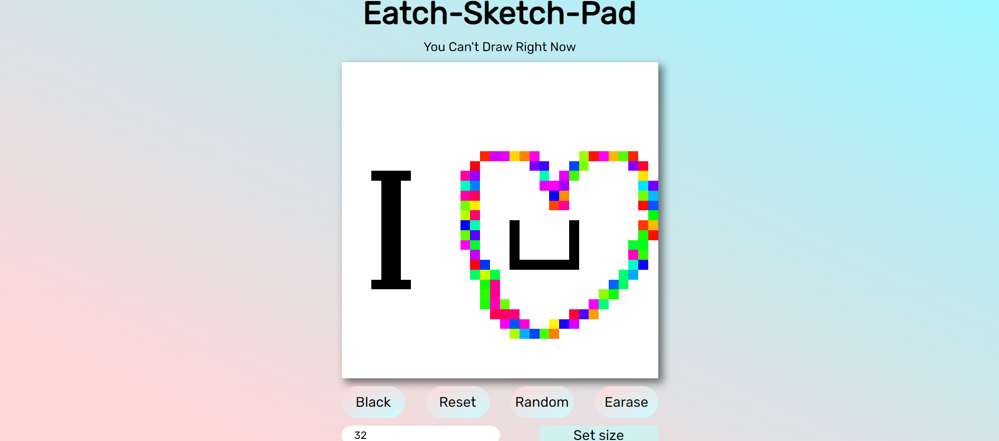

# Etch-A-Sketch
<h1>Eatch-A-sketch pro,ect</h1>

built using vanilla js, html,css

<a href="https://eatchasketch.netlify.app/">visit here</a>
<h4>this project covers: </h4>
<ul>
    <li>DOM manipulation</li>
    <li>frontend styling skills(grid system)</li>
</ul>

